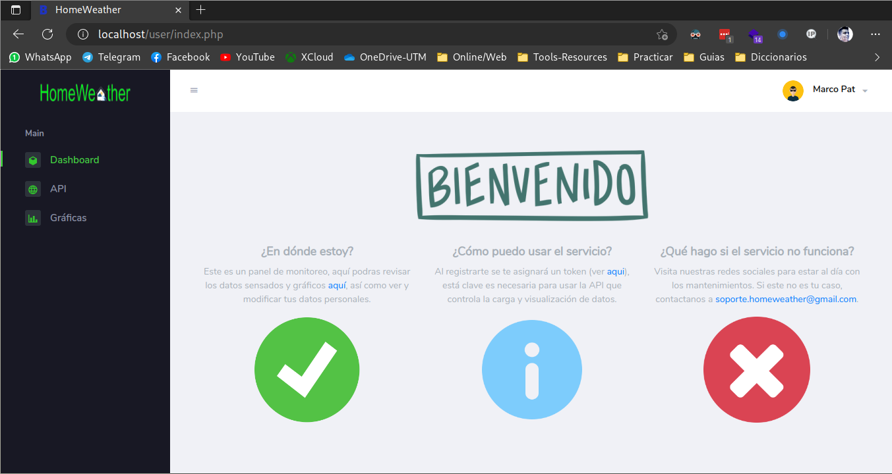
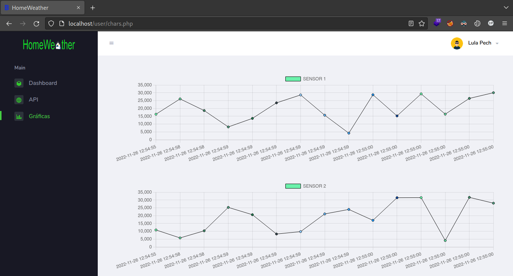
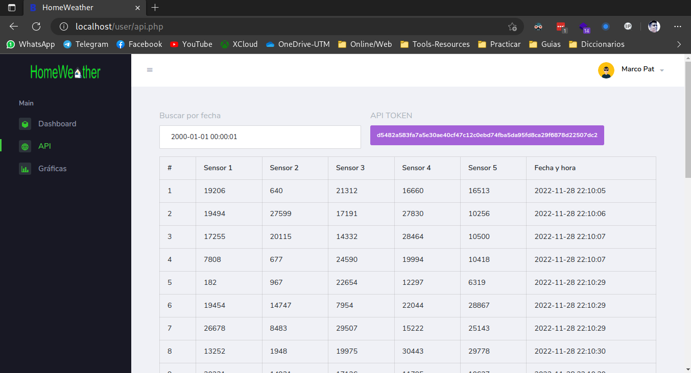
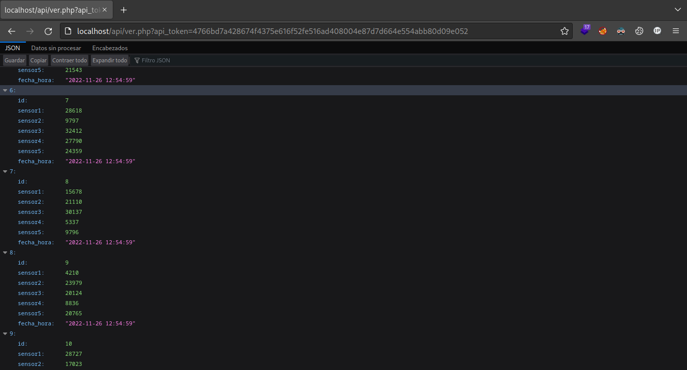

# HomeWeather
HomeWeather is a SmarthHouse system. In the webapp we can upload data from five sensors from a ESP8266 NodeMCU and make a request to get the data in other NodeMCU and controll diferent SmarthHome devices like windows, lights, fans, etc. In a localserver.

## Download and Deploy
```bash
git clone https://github.com/marcopat01/homeweather
cd homeweather
docker-compose up -d
```

## Configuration
### Set database credentials
You should change the the database user and password in the [**Docker Compose file**](docker-compose.yml), these need to be the same as the [**config.php file**](web/html/config/config.php). The **root** password doesn't must to be the same like the normal user.

### Create the tables
We can create them in the phpMyAdmin service running in **localhost:8080** importing the [**MySQL file**](homeweather.sql) in the **homeweather** database.

### Domain and IP
If you want to access at the service with a domain or IP you must change the **"localhost"** with your IP or domain in these files:
* [**htaccess ErrorDocument**](web/html/.htaccess)
* [**Admin Chars url**](web/html/admin/chars.php)
* [**User Chars url**](web/html/user/chars.php)
* [**Admin API url**](web/html/admin/configuracion.php)
* [**User API url**](web/html/user/configuracion.php)

If you are going to use SSL/TLS you must change the **"http"** for **"https"** as well.

### Up the service in the startup and reboot (optional)
To run this service when the server start just copy the [**service file**](webapp.service) like root or with sudo in the system folder and enable the service:
```bash
sudo cp webapp.service /etc/systemd/system/
sudo systemctl enable webapp.service
```
**RECOMENDATION:** run once ```docker-compose up``` to create the php-apache image, volume, etc. And later do this.

## ESP8266 NodeMCU code and configuration
Comming Soon!

## Demo





